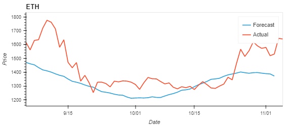
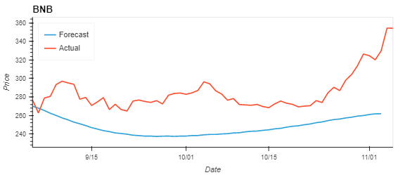

# Cryptocurrency Analysis and Forecast

## Executive Summary
Our project is to explore the correlations between the cryptocurrency market and traditional finance markets to understand whether this is a relationship between the two. We explore that relationship through the quantitative analysis of common economic, equities and commodities indicators including the S&P 500, United States interest rates and gold prices. 

Furthermore, we attempt to predict the future price of 6 common crypto currencies through the use of **Monte Carlo** simulations and  **Meta’s Prophet API**. We then compare the result of both predictions to the actual price change over a 60-day period. 

## Exploratory Data Analysis
* Data cleansing
* Visualisations
* Analysis and forecasting

## Methodology
### Currency Selection
We selected currencies that enjoyed relatively large market caps as well as being old enough to be able to have historical data availabe, important for analysis.  The currencies are:
* Bitcoin - `BTC-USD`
* Ethereum - `ETH-USD`
* Binance Coin - `BNB-USD`
* Dogecoin - `DOGE-USD`
* Monero - `XMR-USD`
* NEM - `XEM-USD`

### Approach
For the collection of our cryptocurrency and commodities data, we used the **Yahoo Finance API** which allowed us to pull historical daily closing prices for our selected tickers. Additionally, we retrieved economic data using the **Federal Reserve Bank of St Louis (FRED) API**. From here we gathered data on the S&P 500, interest rates, GDP, and CPI.

Once we successfully retrieved and cleaned our data, we built a data frame of the cryptocurrencies using the **Pandas library**, and started comparing it to the economic data to check for any correlations. Then we split the data into two datadrames, one to `train` the `Monte Carlo` and `Prophet` models and another as a control dataset against which we can compare the predictions made.

## Findings
Visualising the performance of each currency showed that they largely had the same trend albeit *bitcoin* `BTC-USD` exhitbited changes on a larger magnitude.  

We noted that the currencies exhibited a moderate correlation to each other.  

We were surprised to see a near perfect positive correlation with the S&P 500, and a lower-than-expected positive correlation with Gold and a negative correlation to interest rates. 

After looking at the correlations, we calculated the daily change percentages for the cryptocurrencies to look at which provided investors with the highest returns, as well as looking at the distribution of returns to see a visual representation of volatility of each asset. We observed that *Binance* `BNB-USB` and *DOGE Coin* `DOGE-USD` showed the most volatility and consequently the most potential for risk / reward.

Finally, we attempted to predict prices via the following approach:
1. We split the historical data obtained from **YFinance** into a `training` dataframe and a `testing/control` dataframe.  The contents of the `training` dataframe included historical data up to 2 months prior to current date and the `testing/control` dataframe contained the remaining 2 months worth of data.  
    - We chose a relatively short window to forecast because the long term trend of the currencies showed significant volatility making long term predictions difficult

2. We utilised the `training` dataframe on the **Monte Carlo** simulation algorithm with 1000 simulations and forecast proces for each currency targeting 60 days in the future 
3. We then used the same `training` dataframe to train the **Meta Prophet API** to forecast prices for a similar period
4. We finally compared each prediction against the actual price stored in the `testing/control` dataframe

## Predictions by currency
### Bitcoin `BTC-USC`

    BTC value starting at $19812.37
    Monte Carlo says there is a 95% chance the price will be between $11179.19 and $37501.12
    Prophet predicts $22755.27
    The actual value is $20209.99.

### Ethereum `ETH-USD`

    ETH starting at $1617.18
    Monte Carlo says there is a 95% chance the price will be between $803.70 and $3494.01
    Prophet predicts $1372.31
    The actual value is $1531.54.

### DOGE Coin `DOGE-USD`

    DOGE starting at $0.06
    Monte Carlo says there is a 95% that the price will be between $0.01 and $0.33
    Prophet predicts $0.02
    The actual value is $0.12.

### Binance `BNB-USD`

    BNB starting value $276.69
    Monte Carlo says there is a 95% chance that the price will be between $125.84 and $800.60
    Prophet predicts $261.87
    The actual value is $329.72.

### NEM `XEM-USD`

    XEM starting at $0.04
    Monte Carlo says there is a 95% chance that the price will be between $0.01 and $0.13
    Prophet predicts $-0.05
    The actual value is $0.04.

### Monero `XRM-USD`

    XMR starting at $157.51
    Monte Carlo says there is a 95% chance that the price will be between $65.18 and $375.10
    Prophet predicts $117.02
    The actual value is $149.28.

# Conclusions
The prediction models are not perfect.  The **Monte Carlo** simulations deliver a range that is too wide to be useful for the short forecasting period that we have selected and can be enhanced to narrow the forecast to one standard deviation.  **Meta's Prophet** may perform better once its configuration parameters are better understood and error correction introduced or perhaps even be replaced with other models available in the industry, particularly in order to handle the forecasts going negative.

# Acknowledgments
- [Pandas Library](https://pandas.pydata.org/docs/)
- [YFinance API](https://pypi.org/project/yfinance/)
- [Meta Prophet API](https://facebook.github.io/prophet/)
- [hvPlot Library](https://hvplot.holoviz.org/user_guide/)